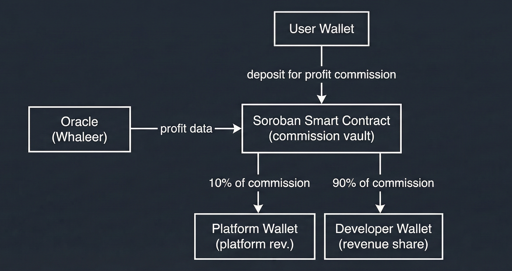

🐋 Whaleer Profit-Sharing Protocol

On-Chain Profit Sharing for Trading Bots Using 3-Wallet Revenue Split + High-Water Mark Fee Model
Powered by Stellar Soroban Smart Contracts

---
1. Overview

Trading bots generate millions in profits every day — but developers, platforms, and users lack a fair, automated, and transparent revenue-sharing mechanism.

**Current ecosystem problems:**
- ❌ No automated profit commissions
- ❌ No transparent developer/platform revenue split
- ❌ No on-chain settlement
- ❌ No High-Water Mark logic
- ❌ Platforms must trust centralized systems

**Whaleer Profit-Sharing Protocol solves this.**

### What This Protocol Enables
- 3-way automated commission distribution
- High-Water Mark (HWM) based performance fee
- Fully on-chain deposit / withdraw
- Freighter-based non-custodial signing
- Automated fee distribution via Soroban Smart Contracts


2. System Architecture

### 2.1 Three-Wallet Revenue Model




### 2.2 Full System Flow


---

## 3. Stellar Communication via Oracle

### Why an Oracle?

Soroban smart contracts **cannot** directly access external data (like trading bot profits). They are isolated and deterministic by design. To bridge this gap, we use an **Oracle pattern**:

```
┌─────────────────┐     Profit Data      ┌─────────────────┐
│  Trading Bot    │ ───────────────────► │    Whaleer      │
│  (External)     │                      │    Oracle       │
└─────────────────┘                      │   (Backend)     │
                                         └────────┬────────┘
                                                  │
                                                  │ settle_profit()
                                                  ▼
                                         ┌─────────────────┐
                                         │ Soroban Smart   │
                                         │   Contract      │
                                         └─────────────────┘
```

### How It Works

1. **Trading bots** report daily P&L to Whaleer backend
2. **Backend (Oracle)** validates profit data and applies HWM logic
3. **Oracle calls `settle_profit()`** on the smart contract
4. **Contract distributes** commission to Developer + Platform wallets
5. **All on-chain** — fully auditable and transparent

### Why This Architecture?

| Challenge | Solution |
|-----------|----------|
| Contracts can't fetch external data | Oracle pushes verified data |
| Need real-time price feeds | CoinGecko API integration |
| Complex HWM calculations | Backend handles logic, contract enforces distribution |
| Trust in Oracle | All transactions on-chain, verifiable |

### Oracle Security

- Oracle only triggers `settle_profit()` — cannot withdraw user funds
- User deposits/withdrawals require **user signature** (Freighter)
- All commission flows are **immutable** once set in `init_vault()`

---

## 4. High-Water Mark (HWM)

A hedge-fund-grade performance fee model ensuring fairness.

### Why HWM?
- User pays fees **only** on new profits
- Losses reset fee eligibility
- Prevents double-charging

### Example

| Day | Balance | Action | HWM |
|-----|---------|--------|-----|
| Start | $100 | — | $100 |
| Day 1 | $120 | Fee on +$20 | $120 |
| Day 2 | $90 | No fee (loss) | $120 |
| Day 3 | $130 | Fee on +$10 only | $130 |


---

## 5. Commission Model

### Stakeholder Split

| Party | Description | Commission Share |
|-------|-------------|------------------|
| **Developer** | Bot creator, sets rate | 90% of commission |
| **Platform** | Protocol operator | 10% of commission |
| **User** | Pays from profits only | — |

### Example: Developer Sets 10% Rate

```
User Profit: $100
     │
     ▼
Total Commission: $10 (10% of profit)
     │
     ├──► Developer: $9 (90% of $10)
     │
     └──► Platform: $1 (10% of $10)
```

### Soroban BPS Conversion

Backend converts percentages to Soroban Basis Points (BPS):

```python
profit_share_bps = total_commission_rate * 100   # 10% → 1000
platform_cut_bps = platform_cut_percent * 100    # 10% → 1000
```

Contract calculation:
```rust
total_commission = profit * profit_share_bps / 10000;
platform_fee = total_commission * platform_cut_bps / 10000;
developer_fee = total_commission - platform_fee;
```

---

## 6. Soroban Contract Functions

| Function | Description | Signer |
|----------|-------------|--------|
| `init_vault` | Creates storage for user-bot pair | Platform (backend) |
| `deposit` | User funds fee reserve | User (Freighter) |
| `withdraw` | User withdraws remaining fees | User (Freighter) |
| `settle_profit` | Distributes fee to dev + platform | Platform (backend) |

### XDR Signing Flow

```
1. Backend creates unsigned XDR
          ↓
2. Frontend sends XDR to Freighter
          ↓>
3. User signs locally (non-custodial)
          ↓
4. Signed XDR sent back to backend
          ↓
5. Backend submits to Soroban
          ↓
6. Smart contract executes fee logic
```

## 7. Backend Architecture

### Key Responsibilities
- Create XDR transactions
- Manage High-Water Mark logic
- Simulate trading profits
- Trigger settlement calls
- Track user state
- Handle deposit/withdraw flows

### API Endpoints

| Endpoint | Method | Description |
|----------|--------|-------------|
| `/bots` | GET | List available trading bots |
| `/status` | GET | Get user's current status |
| `/create-deposit-tx` | POST | Create deposit XDR for signing |
| `/submit-transaction` | POST | Submit signed transaction |
| `/simulate-day` | POST | Simulate daily trading |
| `/create-withdraw-tx` | POST | Create withdraw XDR |
| `/submit-withdraw` | POST | Submit signed withdrawal |

---

## 8. Installation & Running

### Prerequisites
- Node.js v18+
- Python 3.9+
- Git
- [Freighter Wallet](https://freighter.app/) browser extension (set to **Testnet**)

### Quick Start

```bash
# 1. Clone the repository
git clone https://github.com/Apollous1592/Stellar-Hackathon-Project-Whaleer.com.git
cd Stellar-Hackathon-Project-Whaleer.com

# 2. Start Backend (Terminal 1)
cd api
pip install -r requirements.txt
python index.py
# ✅ Backend running on http://127.0.0.1:5328

# 3. Start Frontend (Terminal 2)
cd frontend
npm install
npm run dev
# ✅ Frontend running on http://localhost:3000
```

### Get Testnet XLM

1. Open [Stellar Laboratory](https://laboratory.stellar.org/#account-creator?network=test)
2. Paste your Freighter wallet address
3. Click **"Get test network lumens"**
4. You'll receive 10,000 testnet XLM

### Using the Demo

1. **Connect Wallet** → Click "Connect Freighter" (ensure Testnet mode)
2. **Select Bot** → Choose a trading bot to follow
3. **Deposit** → Deposit XLM as commission reserve (min 5-10 XLM)
4. **Simulate** → Click "Simulate Day" to see daily P&L
5. **Watch** → See commission distributed to Developer & Platform
6. **Withdraw** → Take back remaining balance anytime

---

## 9. Security

- ✅ **Non-custodial signing** — User keys never leave Freighter
- ✅ **No developer private key stored** — Backend only holds platform admin key
- ✅ **On-chain transparency** — All transactions auditable
- ✅ **Immutable fee flows** — Smart contract enforces rules

**TESTNET DEMO** — This uses Stellar Testnet, no real funds involved.

---

## 10. Why This Project Stands Out

### Innovation
- **First 3-party revenue model on Soroban**
- On-chain performance fee settlement
- High-Water Mark implemented in smart contracts

### Technical Depth
- Custom XDR generation pipeline
- Full contract invocation flow
- State management + fee reserve
- Multi-wallet commission distribution
- Real-time XLM/USD price integration

### Real-World Value
- Bot marketplaces can adopt instantly
- Developers monetize performance fairly
- Platforms earn transparent revenue
- Users pay only on actual profits

---

## 11. Links

- **Whaleer.com**: [https://whaleer.com](https://whaleer.com)
- **Stellar**: [https://stellar.org](https://stellar.org)
- **Soroban Docs**: [https://soroban.stellar.org](https://soroban.stellar.org)
- **Freighter Wallet**: [https://freighter.app](https://freighter.app)

---

## License

MIT License — Built for Stellar Hackathon 2025

---

<p align="center">
  <b>🐋 Whaleer — Follow the Whales, Share the Profits 🐋</b>
</p>
